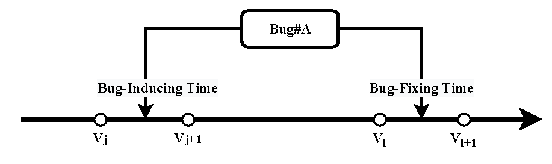

## Why and How Blocking Relations between Bugs are Breakable: An Empirical Study on Breakable Blocking Bugs
In this software repository, we present the source code and dataset in this study in the following two folders, respectively.
- code. This folder contains the source code for this study.
- datasets. This folder contains the three datasets used in RQ1-RQ3 and the manual analysis results of RQ4-RQ5 in this paper. 
    - These dataset files contain the project name, Bug ID, the evaluation metrics of these bugs proposed in RQ1-RQ3, and the corresponding bug categories.
    - These manual analysis results include the results of separate manual reviews of BBPs by two authors, and the final analysis results after discussions among three authors. Each file contains ID, project name, blocking bug ID, blocked bug ID, reasons and measures for breaking the blocking relationship.

Next, the functions in the source code are introduced in detail.
- To calculate the breakable blocking bugs in the project, it is necessary to extract the basic bug information and bug activity information on Bugzilla in each project. Among them, the basic information of the bug can be obtained by searching the Bug ID on the Bugzilla of different projects. The Bugzilla link for each project is as follows, and users can search the Bug ID on these Bugzilla links.
    - eclipse: http://bugs.eclipse.org/bugs/
    - mozilla: https://bugzilla.mozilla.org
    - freedesktop: https://bugs.freedesktop.org
    - netbeans: https://netbeans.org/bugzilla/
    - openoffice: https://bz.apache.org/ooo/

- The basic bug information of the project and the activity information of the bug are also required when calculating the metrics of RQ1 and RQ2. The corresponding two functions in the code file need to input the file path where the bug information is stored. 

- When calculating the metrics of RQ3, since the calculation of these characteristics is based on the static analysis results of Understand, developers need to perform static analysis on the corresponding version of the project manually. The version information of these projects is saved to the versions file. In addition, the commit information in the project needs to be used when mapping bugs to source files, mainly including commit time, commit description information, and changed file information on commit. This information needs to be obtained by the developer from the version information of the project.

Then, the files in the datasets file are described.
- In the dataset folder, it mainly includes the datasets on RQ1, RQ2, and RQ3. These files mainly include: project name, bug id, bug type, and corresponding metrics. RQ3 calculates the metric value on the source file, so it also includes the source file information and the bugs corresponding to the source file.

- In addition, the datasets file also has the results of manual analysis of the reasons and measures of breaking the blocking relationship on bugs in RQ4 and RQ5. These two files ("review_result_1.txt" and "review_result_2.txt") are the results of manual analysis conducted by two authors respectively, and "final_review_result.txt" is the result of the final manual analysis.

- This file ("bug_distribution.csv") shows the overall distribution of different types of bugs and the distribution of different types of bugs that can be matched to commits.

Finally, we introduce the specific process of implementing the method in this paper:
- First, you need to get all the bugs in the project from Bugzilla. Corresponding bug IDs need to be provided, developers can retrieve these bug IDs on the Bugzilla official website. Then, you can execute the script to download the comment and activity information of these bugs. At the same time, it is also necessary to obtain the source code and all commit information of the project. Developers need to retrieve the code hosting platform of these projects, which mainly requires the manual participation of developers.
- Then, you can run the source code we provided to extract the blocking bugs in the project.
- Then, you can analyze the fixing time of the two bugs on these blocking bug pairs to determine whether the bug pair is breakable. If so, you label the blocking bugs as breakable blocking bugs.
- Based on the extracted basic bug information, you can run the source file we provided and extract the three metrics proposed in RQ1 on each bug.
- Based on the extracted bug activity information, you can preprocess the activity information on each bug.
- Based on these metrics proposed in RQ2, you can use the preprocessed activity information to obtain these metrics.
- In order to calculate the metric value on RQ3, you first need to run the script to detect the fixing commit corresponding to each bug, so that you can find the source file changed when each bug is fixed. These sources are then analyzed using Understand, from which the metrics proposed by RQ3 are extracted on each source file. Finally, the metric values on these source files are mapped to the corresponding bugs to form the dataset in RQ3. Since in this step, the static analysis of the source code is mainly performed through Understand, the developer needs to perform this process manually.
- Randomly sample the breakable blocking bug pairs in these projects, and three different developers analyze the reasons and measures for the breaking of the blokcing relationship on these bug pairs, so as to obtain the experimental results of RQ4 and RQ5.

In addition, because the process of obtaining source file complexity measures in RQ3 is complicated, it may cause ambiguity for readers. Therefore, we combine a diagram to explain this process in detail.
1. Assuming that the project has a Bug#A, we first detect whether the project's commit title contains the bug ID (i.e., A). If included, the commit is considered to be a fixing commit to resolve the bug. 
2. We extract the bug-fixing source files on these commits, which are considered source files changed when fixing these bugs.
3. We calculate the five metrics on these obtained source files to evaluate the complexity of the source code. The specific process is as follows:
    1. In order to obtain file-based metrics in RQ3, we need to statically analyze all source files on each version of the project. Therefore, we have to obtain the version of the project where developers submitted these bug-fixing commits.
	2. Since there are a large number of fixing commits on each project, it is impossible for us to restore the project to the corresponding version for each fixing commit. Many previous studies have also shown that it is very difficult to accurately map these bugs to the corresponding source code. In this study, we obtained 10 project versions with similar time intervals on each project. 
	3. Based on the time on this commit, the bug-fixing time when the bug Bug#A was fixed can be determined, that is, the bug-fixing time is between versions V_i and V_(i+1). Of course, the commonly used SZZ algorithm can also be used to determine the inducing commit of the bug, so that the bug-inducing time can be determined. The bug-inducing time is between versions V_j and V_(j+1), which is earlier than the bug-fixing time. Since this study mainly focuses on the characteristics of blocking bugs during repair, we do not focus on the bug-inducing time. 
	4. Based on the time on the fixing commit (i.e., bug-fixing time), we obtain the previous project version closest to the commit‘s submission time, that is, the version V_i. This is because we mainly explore the code complexity when fixing blocking bugs in this paper, and the bug has been fixed in version V_(i+1). Therefore, we obtain the project version V_i and perform static analysis on the project source code on this version to extract the code complexity measurement on the source files modified in the bug-fixing commit. This approach has also been used in many other studies, which consider not only the bug-fixing commit but also the commits before the bug-fixing commit in their analysis. We have cited these references to illustrate this approach in this paper, which shows that this method is reliable to a certain extent.
